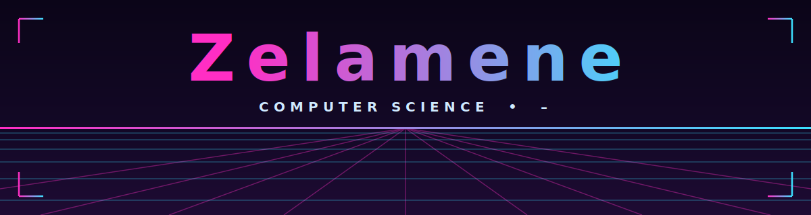

  

  

  

---

###  About me

-  Final-year **Computer Science** student, building things end to end.
-  Comfortable across the stack — backend services, web apps, databases, and a bit of graphics.
-   Off the keyboard you'll find me watching **football** and **basketball**.
-  Ask me about anything I'm building — always happy to talk shop.

---

###  Tech stack

  

  
  
  

---

###  GitHub stats

  
  

  

---

###  Words I code by

> *"At some point it's not enough to be a dog that plays the piano — you have to play the piano well."*

---

###  Connect

  
  

